# Shapes with Code version 0.0.1
You can give some parameter using GUI, so You will be able to watch many shapes.  
If you find favorite shape you can generate code or image.

It might be more interesting to be able to give more options.  
But I think the world is more interesting when there are rules.
  
- [Sketch with Code (https://toshiya-marukubo.github.io/sketchWithCode/index.html)](https://toshiya-marukubo.github.io/sketchWithCode/index.html)  
- [Sketch with Code via CodePen(https://codepen.io/toshiya-marukubo/full/8545d5684ef53024cf9ee8d12050adbd)](https://codepen.io/toshiya-marukubo/full/8545d5684ef53024cf9ee8d12050adbd)

## Generated Code
You can use generated code on your Canvas using ['my Shapes library']('https://github.com/toshiya-marukubo/toshiya-marukubo.github.io/blob/main/sketchWithCode/README.md'). 
Please download 'shapes.js' in scripts file. But not supported effect, line up.

### How to Use the Code
Paste the generated code into script tag.
```
// load shapes file
<script src="./scripts/shapes.js"></script>
<script>
  /**
   * draw circle
   * @param {object} options - you can easily generate options by using sketch with code.
   */
  Shapes.circle({
    ctx: ctx,
    common: {
      x: 0,
      y: 0,
      scaleOne: 200,
      scaleTwo: 0,
      theta: 360,
      numberA: 4,
      numberB: 1,
      rotationAngle: 0,
      lineWidth: 1
    },
    text: {
      on: false,
      value: "",
      family: "",
      textAlign: "",
      textBaseline: "",
      style: "",
      variant: "",
      weight: ""
    },
    line: {
      on: false,
      cap: "",
      join: "",
      miterLimit: 0
    },
    shadow: {
      on: false,
      color: "",
      offsetX: 0,
      offsetY: 0,
      blur: 0
    },
    composite: {
      on: false,
      alpha: 1,
      operation: ""
    },
    shapeColor: {
      fillTransparent: true,
      fill: "",
      strokeTransparent: false,
      stroke: "#000000"
    },
    shapeGradient: {
      on: false,
      type: "",
      startColor: "",
      endColor: "",
      point: 0
    }
  });
</script>
```
### Generate Images Exsample
Changing the parameters will draw images like these.  


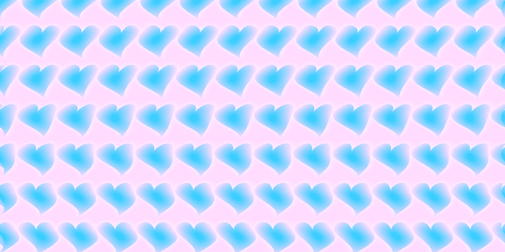

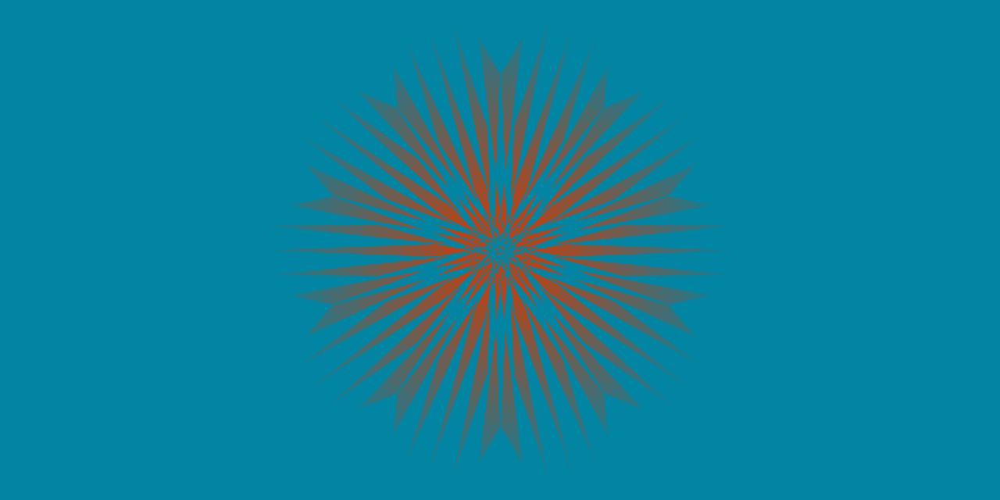

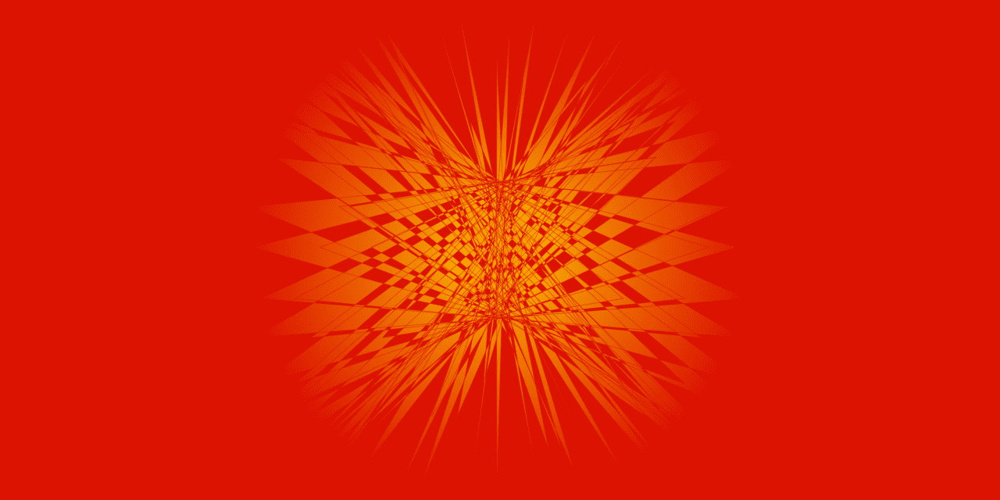

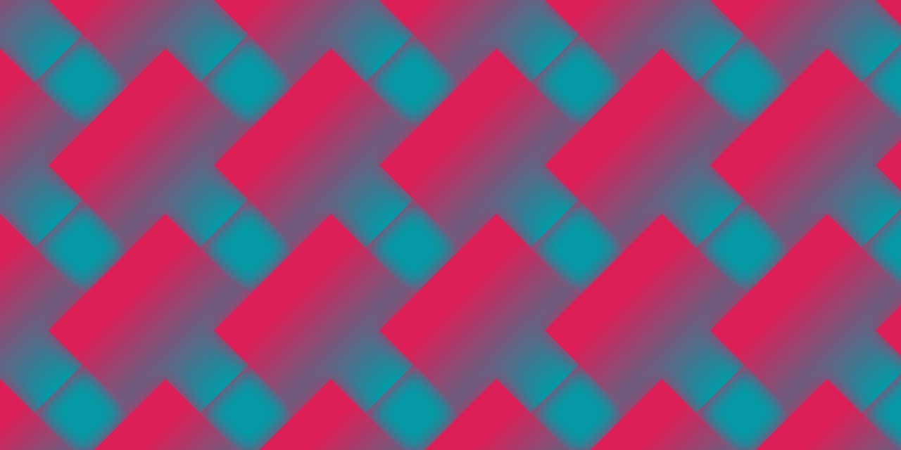

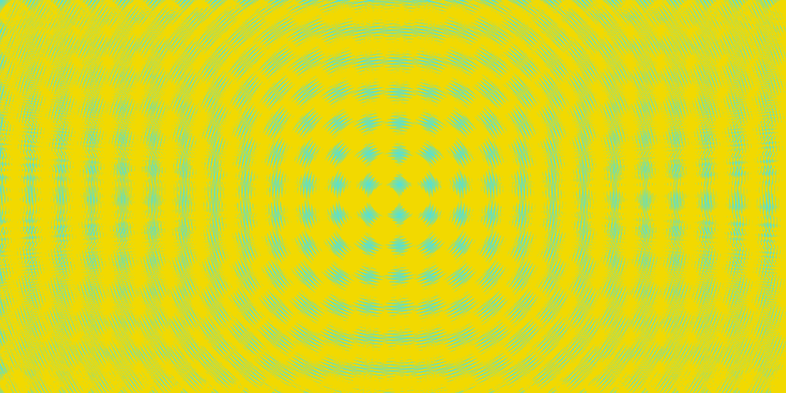

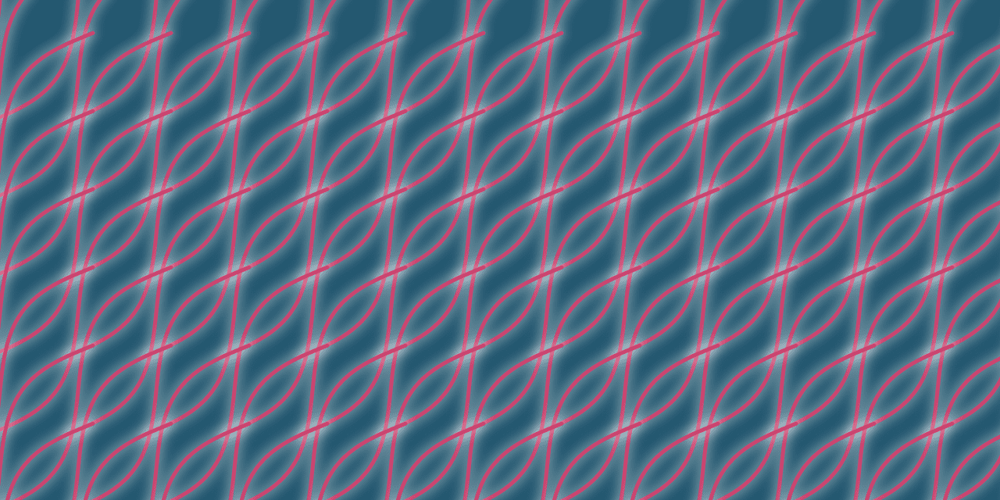

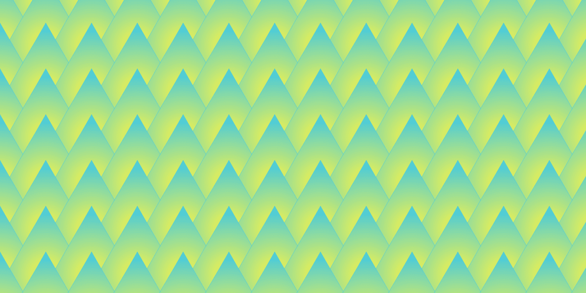

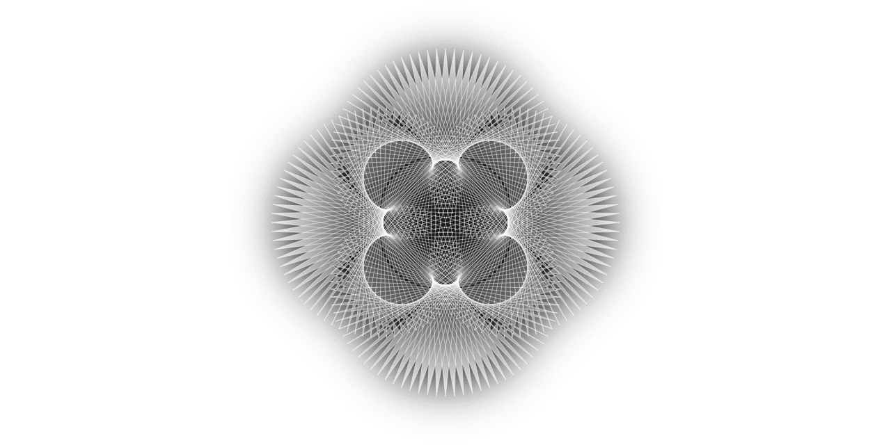

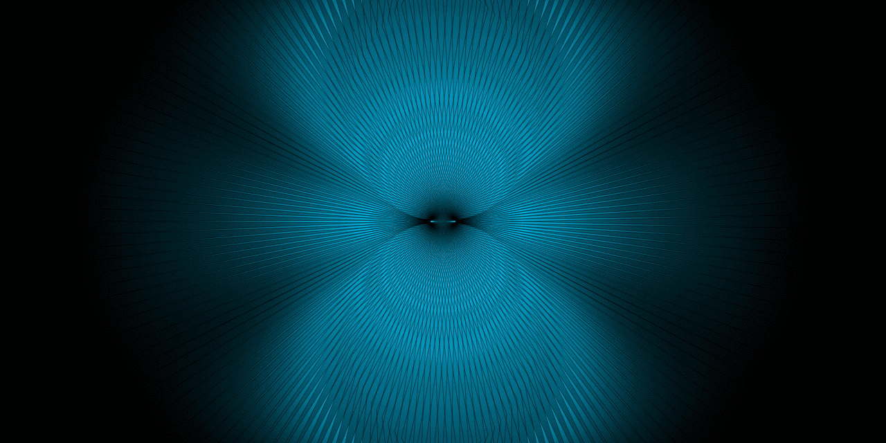

### Basic shapes that can be drawn now.
Changing parameters these shapes and then you can watch interesting shape.

circle

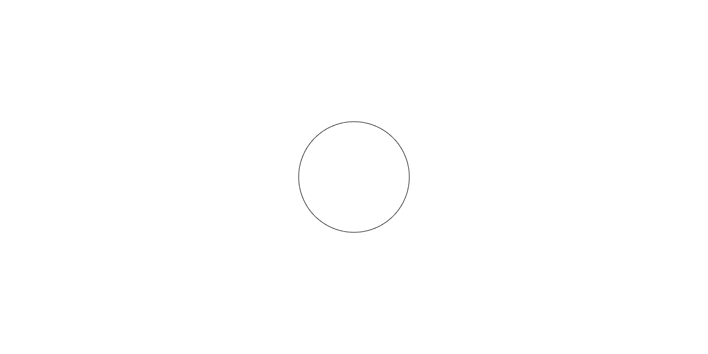

ellipse


lemniscate

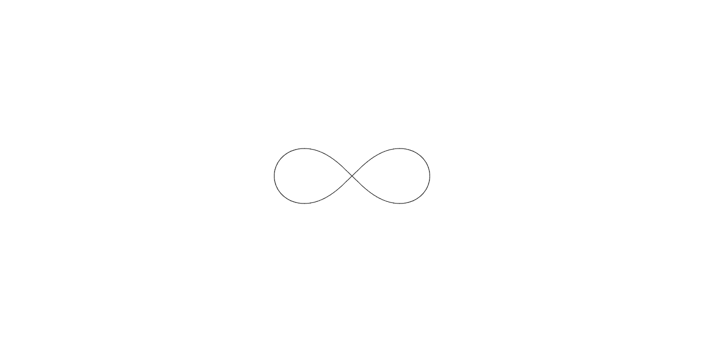

text


rectangle

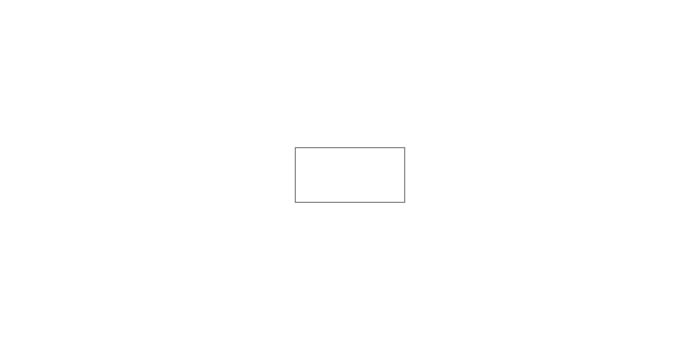

polygon

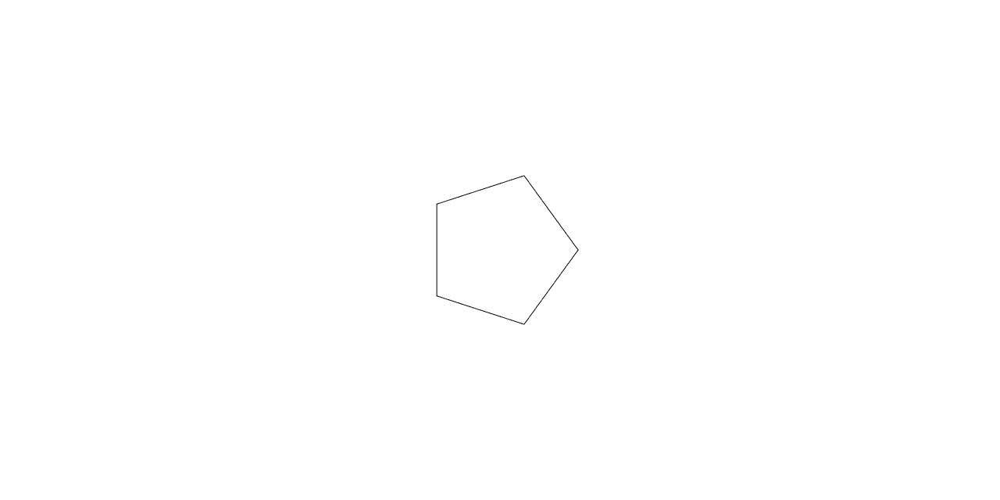

polygonStar

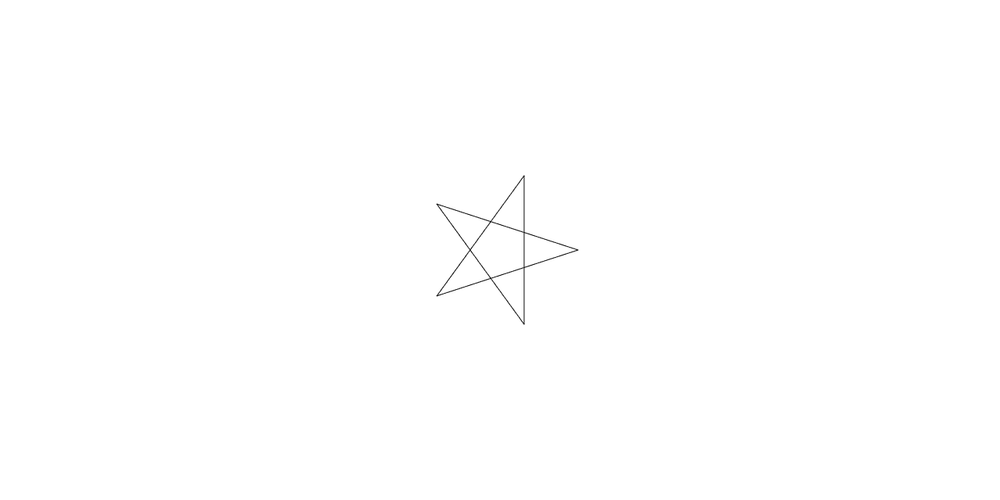

sin

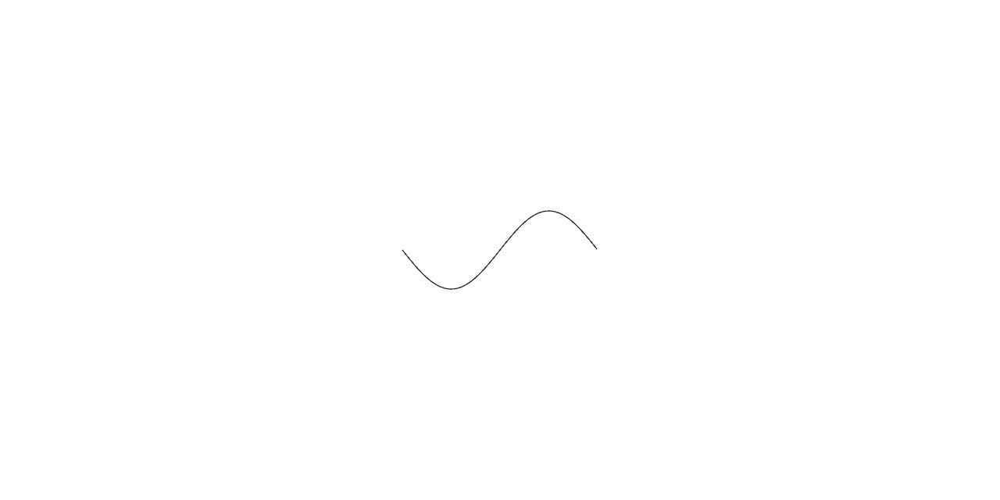

cos


tan

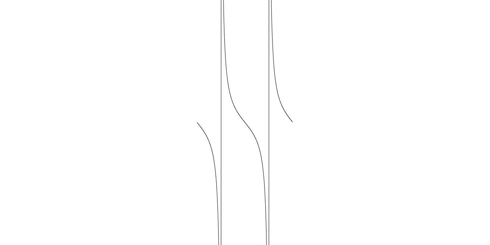

heart

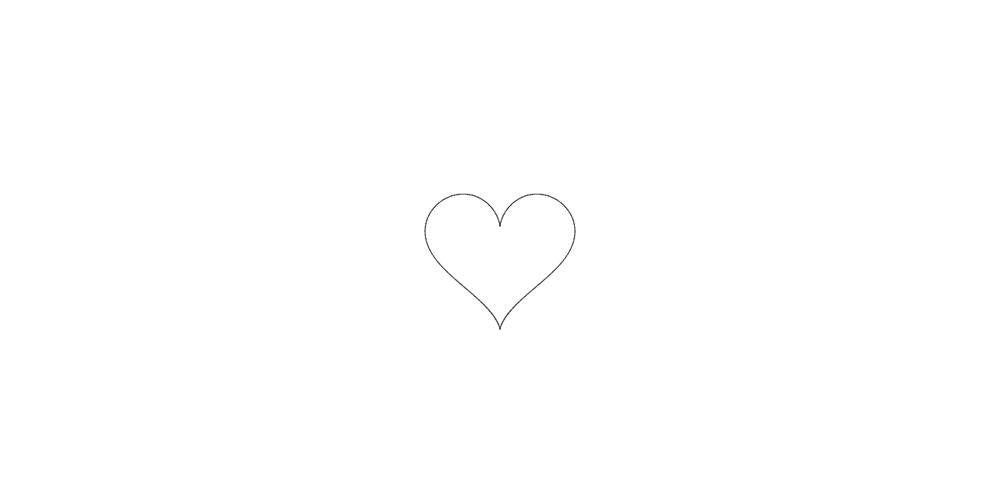

rose


astroid

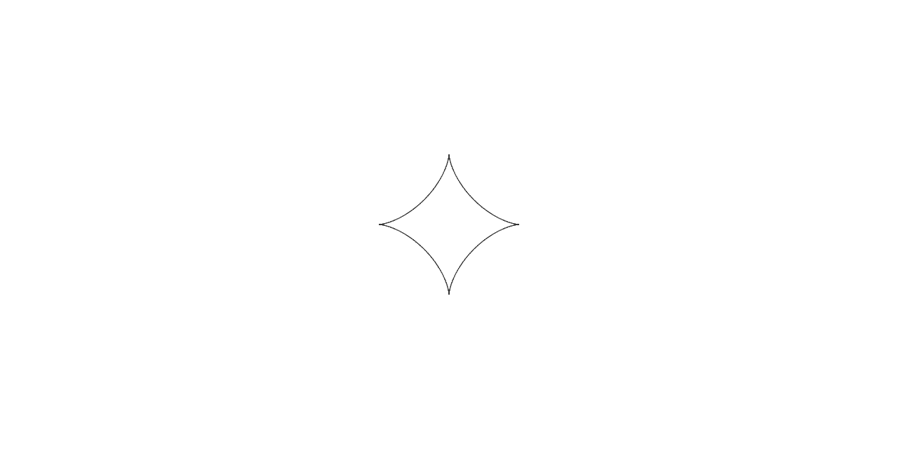

lissajous

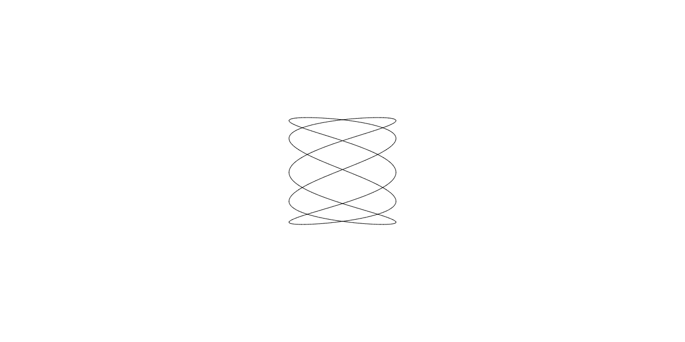

archimedesSpiral

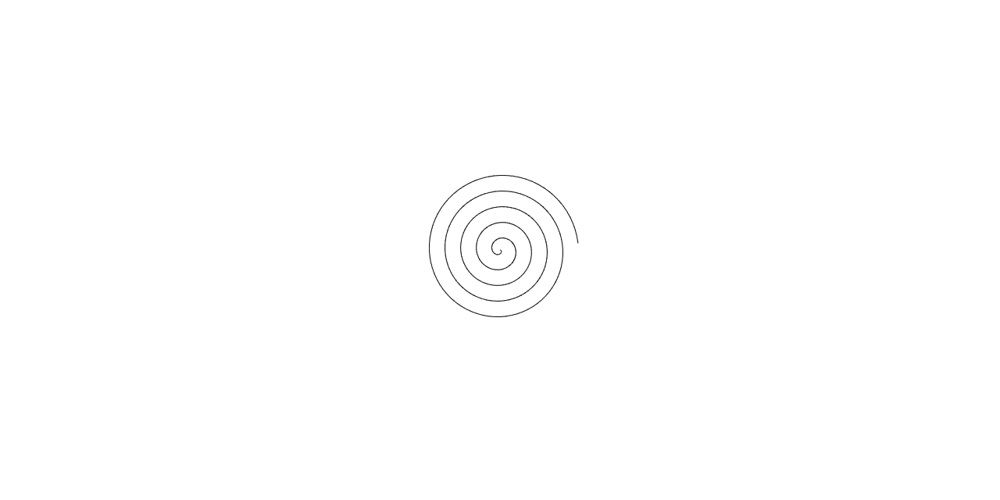

fermatSpiral

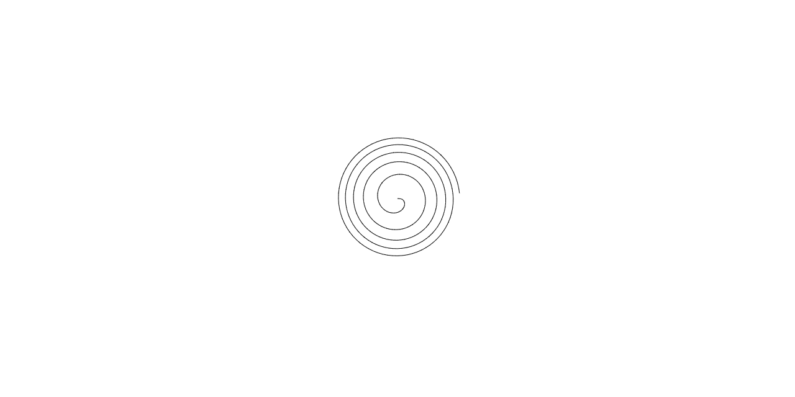

#### Support
Not supported IE.

#### License
shapes.js is MIT.

##### Thanks to
I referenced these sites.
- [https://mathworld.wolfram.com/](https://mathworld.wolfram.com/)
- [https://tomari.org/main/java/kyokusen/top.html](https://tomari.org/main/java/kyokusen/top.html)

I referenced these books.
- [数学から創るジェネラティブアート - Processingで学ぶかたちのデザイン](https://www.amazon.co.jp/%E6%95%B0%E5%AD%A6%E3%81%8B%E3%82%89%E5%89%B5%E3%82%8B%E3%82%B8%E3%82%A7%E3%83%8D%E3%83%A9%E3%83%86%E3%82%A3%E3%83%96%E3%82%A2%E3%83%BC%E3%83%88-Processing%E3%81%A7%E5%AD%A6%E3%81%B6%E3%81%8B%E3%81%9F%E3%81%A1%E3%81%AE%E3%83%87%E3%82%B6%E3%82%A4%E3%83%B3-%E5%B7%B4%E5%B1%B1-%E7%AB%9C%E6%9D%A5/dp/4297104636)
- [JavaScriptゲームプログラミング　知っておきたい数学と物理の基本](https://www.amazon.co.jp/JavaScript%E3%82%B2%E3%83%BC%E3%83%A0%E3%83%97%E3%83%AD%E3%82%B0%E3%83%A9%E3%83%9F%E3%83%B3%E3%82%B0-%E7%9F%A5%E3%81%A3%E3%81%A6%E3%81%8A%E3%81%8D%E3%81%9F%E3%81%84%E6%95%B0%E5%AD%A6%E3%81%A8%E7%89%A9%E7%90%86%E3%81%AE%E5%9F%BA%E6%9C%AC-Future-Coders%EF%BC%88NextPublishing%EF%BC%89-%E7%94%B0%E4%B8%AD-%E8%B3%A2%E4%B8%80%E9%83%8E-ebook/dp/B06XSZ3Y2F/ref=sr_1_10?dchild=1&qid=1622019640&refinements=p_n_feature_seven_browse-bin%3A3232386051&s=books&sr=1-10)
- [ゲーム&モダンJavaScript文法で2倍楽しい グラフィックスプログラミング入門](https://www.amazon.co.jp/%E3%83%A2%E3%83%80%E3%83%B3JavaScript%E6%96%87%E6%B3%95%E3%81%A72%E5%80%8D%E6%A5%BD%E3%81%97%E3%81%84-%E3%82%B0%E3%83%A9%E3%83%95%E3%82%A3%E3%83%83%E3%82%AF%E3%82%B9%E3%83%97%E3%83%AD%E3%82%B0%E3%83%A9%E3%83%9F%E3%83%B3%E3%82%B0%E5%85%A5%E9%96%80-%E2%80%94%E2%80%94%E3%83%AA%E3%82%A2%E3%83%AB%E3%82%BF%E3%82%A4%E3%83%A0%E3%81%AB%E5%8B%95%E3%81%8F%E7%94%BB%E9%9D%A2%E3%82%92%E6%8F%8F%E3%81%8F%E3%80%82%E3%83%97%E3%83%AD%E3%82%B0%E3%83%A9%E3%83%9E%E3%83%BC%E7%9B%B4%E4%BC%9D%E3%81%AE%E5%9F%BA%E6%9C%AC-PRESS-plus/dp/4297110857)

I used these library.
- [reset.css](https://gist.github.com/DavidWells/18e73022e723037a50d6)
- [dat.GUI](https://github.com/dataarts/dat.gui)
- [simplex-noise](https://github.com/jwagner/simplex-noise.js/)

Thank you so much!!!
